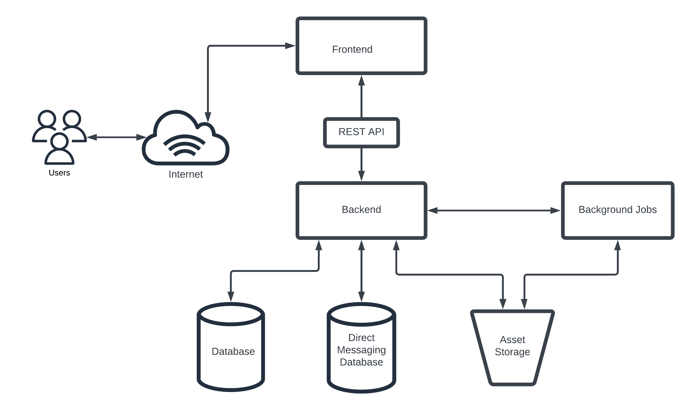

# Week 0 — Billing and Architecture

## Required Homework/Tasks

### Install AWS CLI
I installed AWS CLI on Gitpod manually using this commands below

```
curl "https://awscli.amazonaws.com/awscli-exe-linux-x86_64.zip" -o "awscliv2.zip"
      unzip awscliv2.zip
      sudo ./aws/install
```
### Diagram Proof

## Conceptual Diagram
[Conceptual Diagram Lucid Chart Link](https://lucid.app/lucidchart/3b539b78-558e-44d9-b65b-5783fd9a8bba/edit?viewport_loc=-11%2C61%2C2120%2C999%2C0_0&invitationId=inv_6e192259-5127-4195-9389-8d5956572911)





## Logical Diagram
[Logical Diagram Lucid Chart Link](https://lucid.app/lucidchart/c46186f8-32e2-430e-9584-868406568922/edit?viewport_loc=9%2C-1096%2C2120%2C999%2C0_0&invitationId=inv_b5b3c342-28a3-4eac-8b99-9125b7423722)


### Billing Alarm and Budget
I created a billing alarm and budget using both the AWS console and the CLI using Gitpod

## Homework Challenges
Destroy your root account credentials, Set MFA, IAM role - Done

Review all the questions of each pillars in the Well Architected Tool (No specialized lens) - Done

Create an architectural diagram (to the best of your ability) the CI/CD logical pipeline in Lucid Charts -
I have two diagrams(Logical and Conceptual diagrams) already in Lucid chart, so creating another one exceeds the free tier limit


