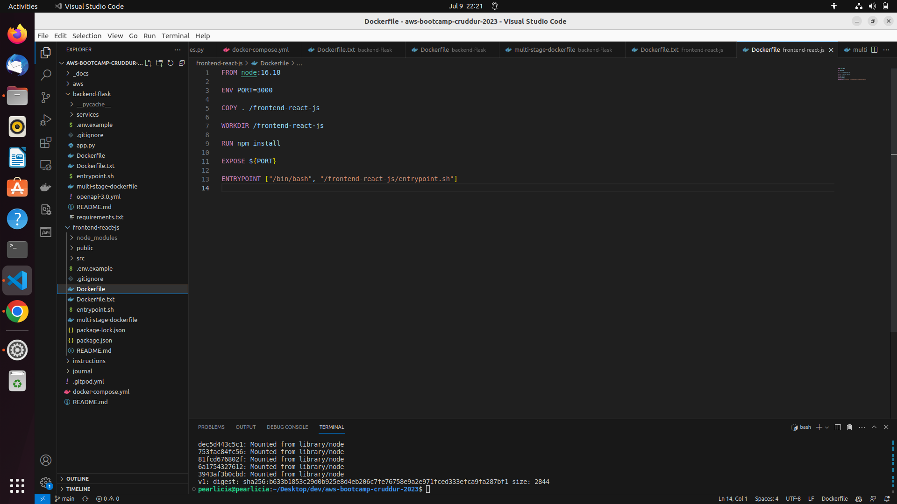

# Week 1 — App Containerization

## Required Tasks

I created a repo using the CRUDDUR repo template and launch the repo within gitpod workspace. Configured gitpod.yml for VSCode Extensions.
I opened the frontend and backend code in gitpod to explore the codebases, I started both apps to run locally.
I wrote dockerfile for both frontend and backend, and built the docker images and ran the apps in individual containers.
Then created a docker compose file to build multiple images and ran the containers successfully.
I also mounted directories so to make changes while I code.
I installed DynamoDB local and postgres in gitpod. Built images on them that ran successfully.

## Homework Challenges    
### Run the dockerfile CMD as an external script

### Tag and push image to DockerHub

### Use multi-stage building for a Dockerfile build

### healthcheck Implementation in the V3 Docker compose file

### Researched best practices of Dockerfiles and implemented them in my Dockerfile
 - I used official base images from trusted sources like Docker Hub. Because they are typically well-maintained, regularly updated, and come with proper security considerations.

 - I kept my images small by minimizing the size of my Docker images by optimizing the layers, reducing the number of dependencies, and removing unnecessary files. Using multi-stage builds to separate build dependencies from the final production image.

 - I utilized environment variables in my Dockerfile to make the image more configurable and flexible. This allows users to customize the container's behavior without modifying the Dockerfile itself.

 - I included health checks within my Docker Compose file to verify the health of my containerized application. This helps monitoring tools and orchestrators determine the state of the application and take appropriate actions if necessary.

### Install Docker on my local machine and get the same containers running outside of Gitpod / Codespaces

### Launched an EC2 instance that has docker installed, and pulled a container to demonstrate I can run my own docker processes. 

