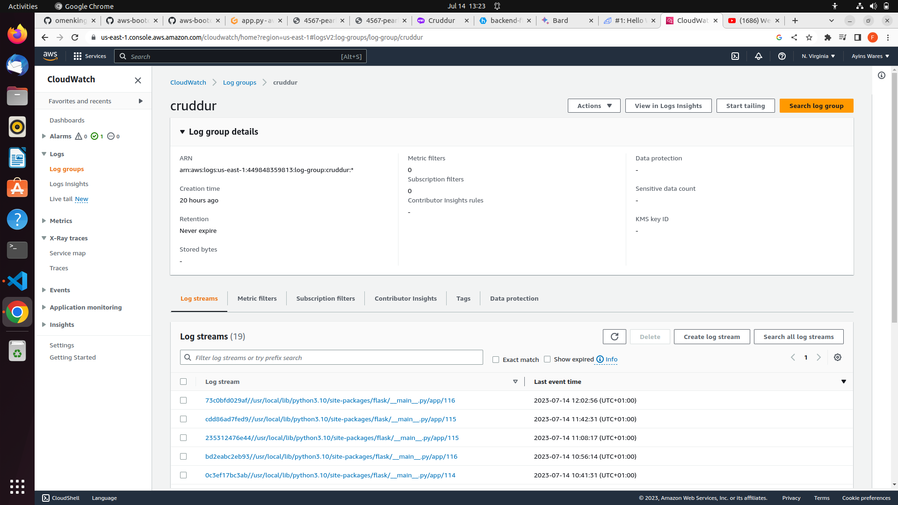
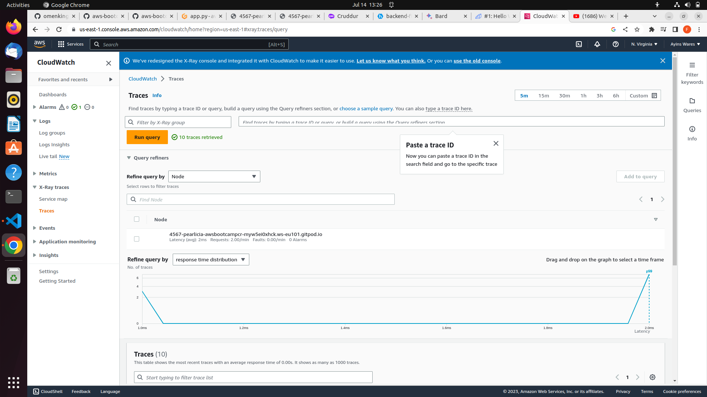
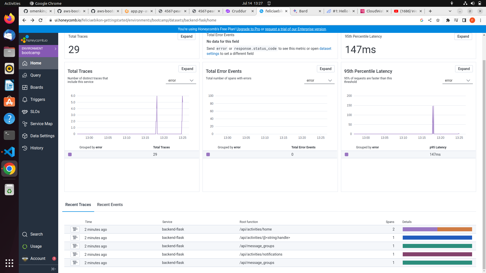
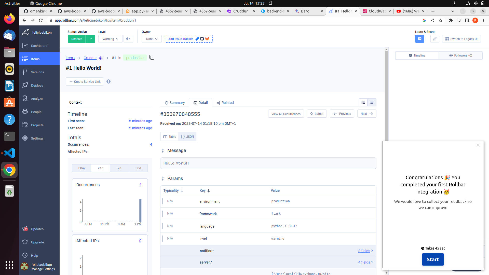

# Week 2 — Distributed Tracing

## Required Tasks

### I successfully Implemented Cloudwatch logs

### I successfully Implemented AWS X-RAY 

### I successfully Instrumented Honeycomb 

### I successfully Instrumented Rollbar 

