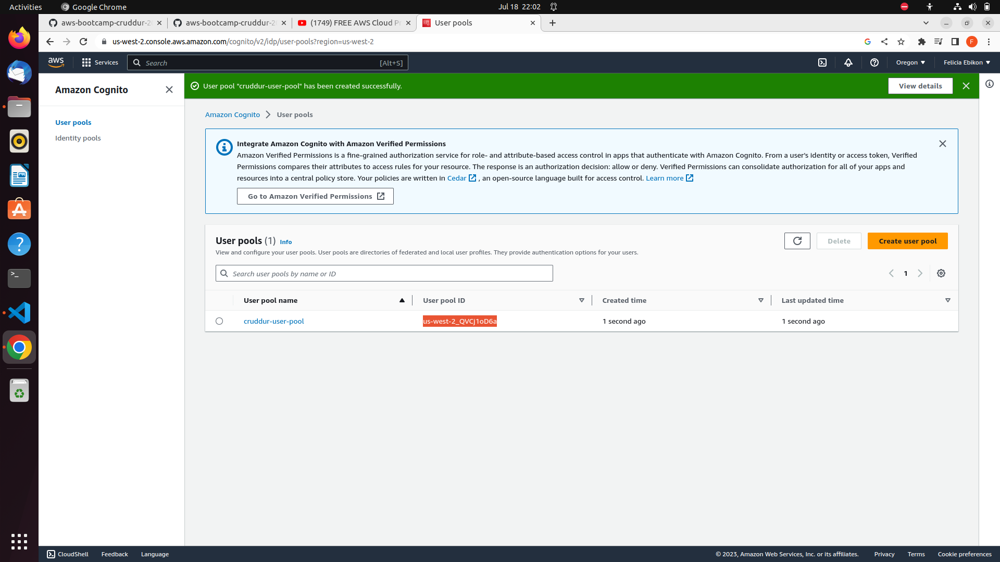
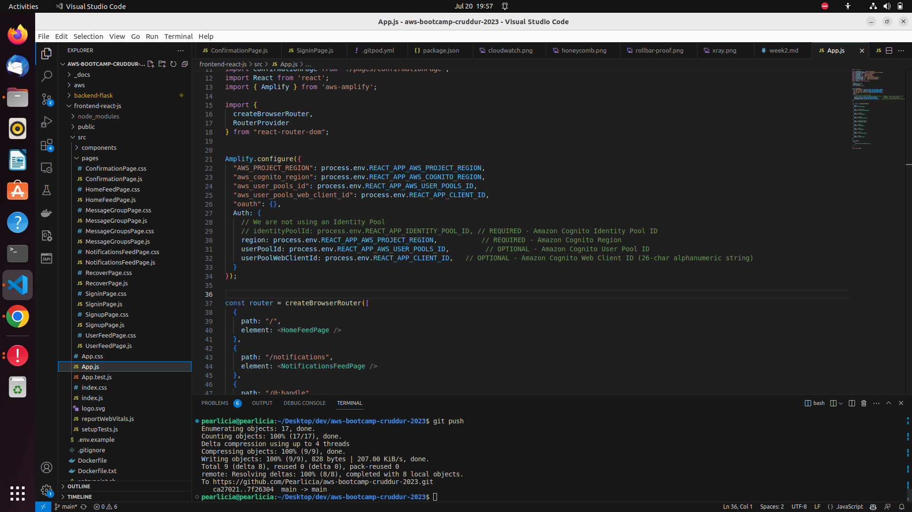

# Week 3 — Decentralized Authentication

## Required Tasks

### Proof of Provisioning via ClickOps Amazon Cognito User Pool

### Proof of Installation and configuration of Amplify client-side library for Amazon Cognito

I Implemented API calls to Amazon Cognito for custom login, signup, recovery and forgot password pages

Also implemented Show conditional elements and data based on logged in or logged out

Implemented backend code to Verify JWT Token to serve authenticated API endpoints