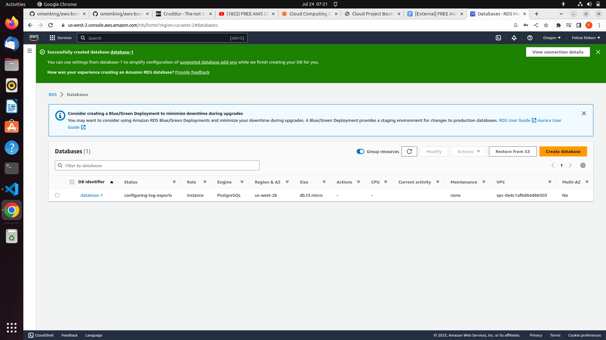
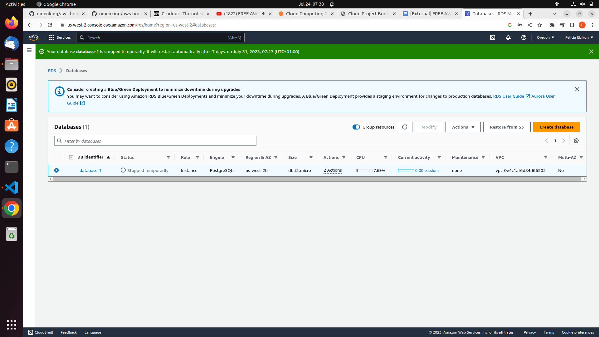
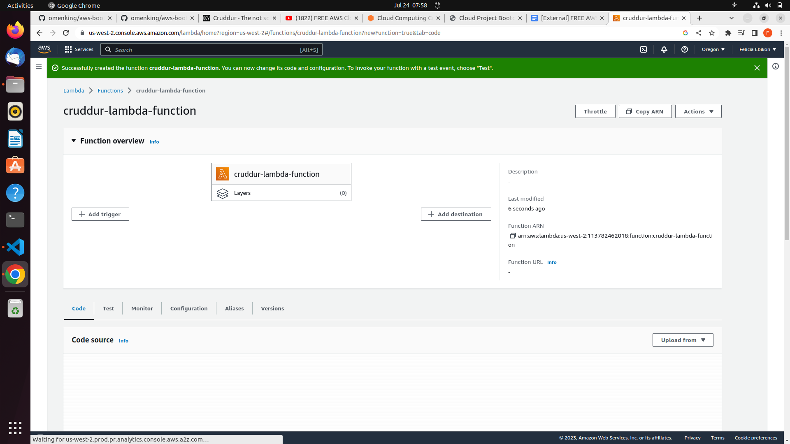
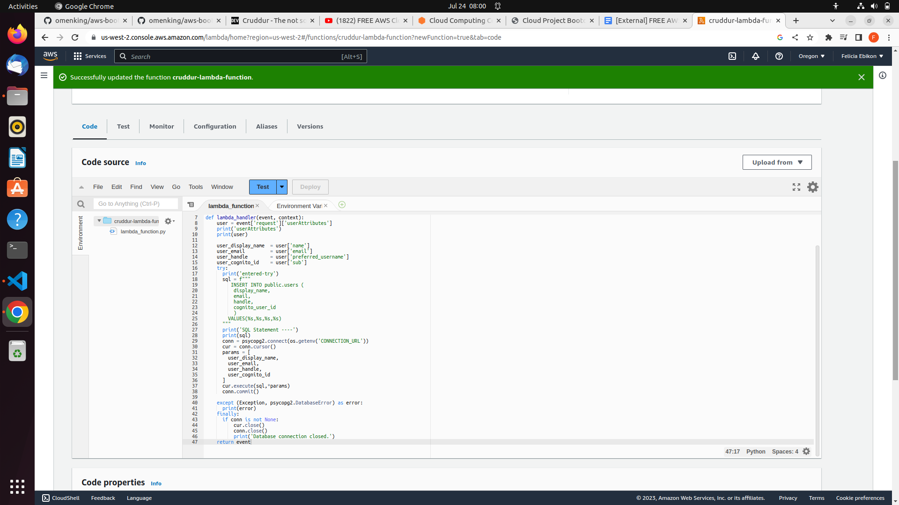

# Week 4 — Postgres and RDS

## Required Tasks

### Proof of Provisioning RDS Instance

### Proof of Stopped RDS Instance

I connected to the remote RDS instance successfully, updated security group rule for postgres 
Wrote bash scripts for database operations, and implemented a postgres client for python using a connection pool
Implemented a Lambda that runs in a VPC and commits code to RDS
Sanitized parameters passed to SQL to execute.

### Proof of creating a lambda function Successfully

### Proof of Lambda function update

